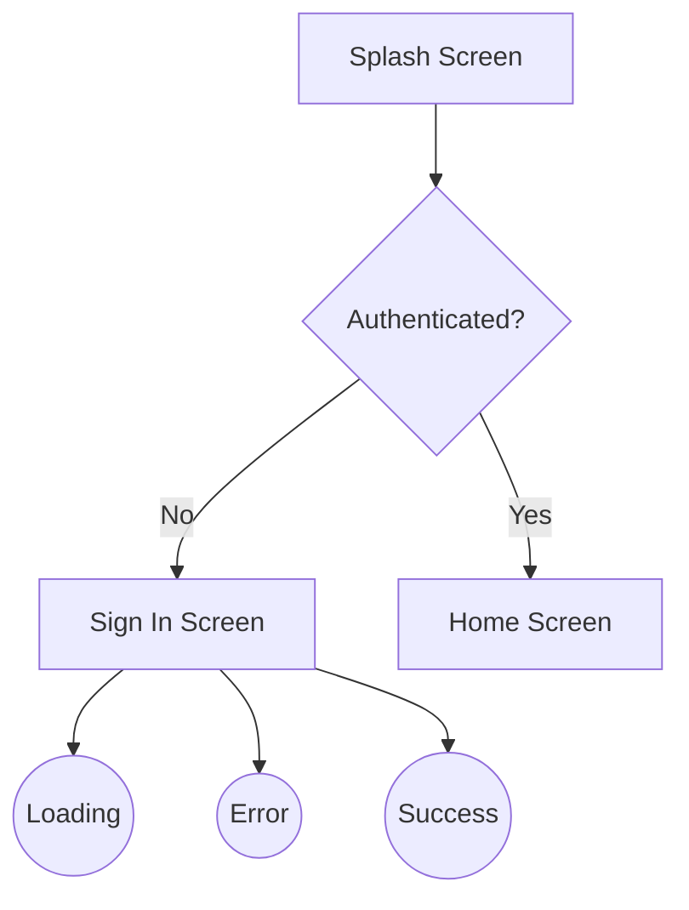
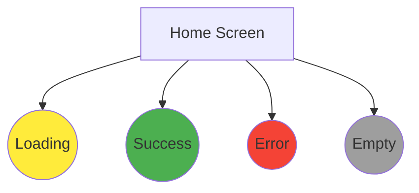
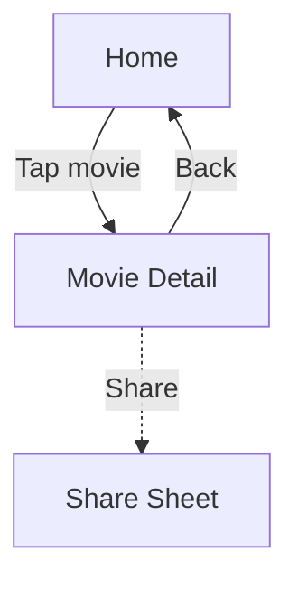
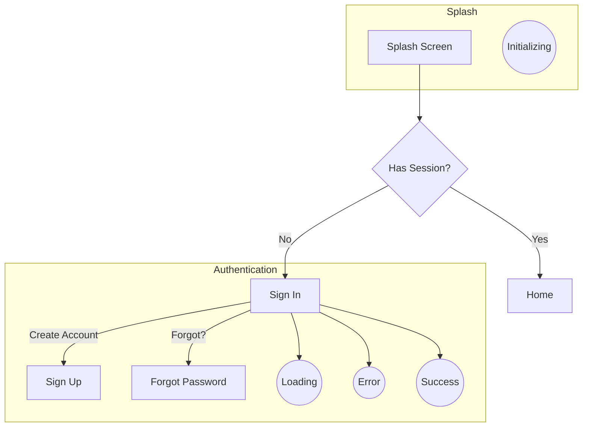

# template_meta
# template_version: "2.81.0"
# template_path: "templates/blueprints/workspace-project/design-spec-layer/FLOW_DRIVEN_DESIGN.md"
# last_modified: "2026-03-19"

# Flow-Driven Design - Source of Truth

> **Purpose**: User flows are the single source of truth for design layer completeness, implementation status, and test generation.
> **Version**: 2.0.0
> **Last Updated**: 2026-03-19
> **Related Rules**: RULE-TDD-001, RULE-LAYER-TEST-001/002/003, RULE-FLOW-STATUS-001

---

## Core Principle

```
┌─────────────────────────────────────────────────────────────────────────────────────────┐
│                         FLOW-DRIVEN DESIGN PRINCIPLE                                     │
├─────────────────────────────────────────────────────────────────────────────────────────┤
│                                                                                          │
│  User Flows (.mmd files)     →    Design Layer (specs, mockups, prompts)                │
│                              →    Test Cases (TDD at every layer)                       │
│                              →    Implementation Status (tracked in flow)               │
│                                                                                          │
│  Every node in a flow        =    A screen/state that MUST have design docs + tests     │
│  Every edge in a flow        =    A transition that MUST be documented + tested         │
│  Every decision point        =    Logic that MUST have 2 tests (true/false paths)       │
│  Every state annotation      =    A UI state that MUST have mockup + screen test        │
│                                                                                          │
│  NOTHING gets missed because the flow defines what must exist.                           │
│  Tests are written FIRST, then implementation (TDD).                                    │
│  Implementation status is tracked IN THE FLOW FILE (single source of truth).            │
│                                                                                          │
└─────────────────────────────────────────────────────────────────────────────────────────┘
```

---

## Flow → Design Mapping

### Node Type → Design Requirement → Test Requirement

| Mermaid Node | Node Pattern | Design Requirement | Test Requirement |
|--------------|--------------|-------------------|------------------|
| Screen | `SCR_*[Screen Name]` | SPEC.md + MOCKUP.md | ScreenTest (4 states) |
| State | `ST_*((State))` | State wireframe in MOCKUP.md | State-specific screen test |
| Action | `ACT_*{Action}` | User interaction documented | Action handler test |
| Decision | `DEC_*{Decision?}` | Logic in SPEC.md Section 4.3 | 2 tests (true/false paths) |
| Subgraph | `subgraph Name` | Feature folder required | ViewModelTest + integration |

### Test Generation from Flow

Every flow node generates test requirements following TDD rules:

```yaml
test_generation:
  SCR_* (Screen):
    layer: feature
    rule: RULE-LAYER-TEST-003
    generates:
      - "{Feature}ViewModelTest.kt"
      - "{Feature}ScreenTest.kt"
    min_tests: 8  # 4 state tests + actions

  DEC_* (Decision):
    layer: feature
    rule: RULE-LAYER-TEST-003
    generates:
      - "test{Decision}_true_{destination}()"
      - "test{Decision}_false_{destination}()"
    min_tests: 2  # One per path

  API endpoint (from SPEC Section 9):
    layer: client
    rule: RULE-LAYER-TEST-001
    generates:
      - "{Feature}ServiceTest.kt"
      - "{Feature}RepositoryTest.kt"
    min_tests: 6  # Success, error, params per endpoint
```

### Example Mapping



**Generates these design AND test requirements:**

| From Flow | Design Requirement | Test Requirement | TDD Rule |
|-----------|-------------------|------------------|----------|
| `SCR_SPLASH` | `features/splash/SPEC.md` | `SplashViewModelTest.kt` | RULE-LAYER-TEST-003 |
| `SCR_SPLASH` | `features/splash/mockups/MOCKUP.md` | `SplashScreenTest.kt` | RULE-LAYER-TEST-003 |
| `SCR_SIGNIN` | `features/auth/SPEC.md` | `SignInViewModelTest.kt` | RULE-LAYER-TEST-003 |
| `SCR_SIGNIN` | `features/auth/mockups/MOCKUP.md` | `SignInScreenTest.kt` | RULE-LAYER-TEST-003 |
| `SCR_HOME` | `features/home/SPEC.md` | `HomeViewModelTest.kt` | RULE-LAYER-TEST-003 |
| `ST_LOADING` | Loading state wireframe | `testLoadingState_showsShimmer()` | RULE-LAYER-TEST-003 |
| `ST_ERROR` | Error state wireframe | `testErrorState_showsRetry()` | RULE-LAYER-TEST-003 |
| `ST_SUCCESS` | Success state wireframe | `testSuccessState_showsContent()` | RULE-LAYER-TEST-003 |
| `DEC_AUTH` | Auth decision logic (SPEC 4.3) | `testAuth_true/false` (2 tests) | FLOW_TEST_GENERATOR |

---

## Completeness Validation

### Flow Coverage Check

```yaml
validation_rules:
  # Every screen node must have:
  screen_completeness:
    - feature_folder_exists: true
    - spec_md_exists: true
    - mockup_md_exists: true
    - all_states_documented: [loading, success, error, empty]

  # Every transition must have:
  transition_completeness:
    - trigger_documented: true       # What causes this transition
    - navigation_mapped: true        # How to navigate
    - params_documented: true        # Data passed

  # Every subgraph must have:
  subgraph_completeness:
    - feature_index_entry: true      # In FEATURES_INDEX.md
    - api_documented: true           # If data-driven
```

### Validation Command

```bash
# Validate design layer against user flows
/gap-analysis-project design --flow-check

# Output:
# ✅ SCR_SPLASH: SPEC.md ✓, MOCKUP.md ✓, States: 4/4
# ✅ SCR_SIGNIN: SPEC.md ✓, MOCKUP.md ✓, States: 4/4
# ❌ SCR_HOME: SPEC.md ✓, MOCKUP.md ❌ (missing error state)
# ❌ SCR_PROFILE: Feature folder missing
```

---

## Design Layer Generation Order

```
┌─────────────────────────────────────────────────────────────────────────────────────────┐
│                         GENERATION ORDER (FLOW-DRIVEN)                                   │
├─────────────────────────────────────────────────────────────────────────────────────────┤
│                                                                                          │
│  Step 1: Parse User Flows (.mmd files)                                                   │
│          └─ Extract all SCR_*, ST_*, ACT_*, DEC_* nodes                                 │
│          └─ Extract all subgraphs as features                                           │
│          └─ Extract all edges as transitions                                            │
│                                                                                          │
│  Step 2: Generate Feature Structure                                                      │
│          └─ Create feature folders for each subgraph                                    │
│          └─ Create SPEC.md skeleton for each screen                                     │
│          └─ Create MOCKUP.md skeleton with required states                              │
│                                                                                          │
│  Step 3: Enrich with Details                                                             │
│          └─ Add user stories based on flow paths                                        │
│          └─ Add state wireframes (all 4 states)                                         │
│          └─ Add navigation documentation                                                │
│                                                                                          │
│  Step 4: Generate API (if data-driven)                                                   │
│          └─ Extract endpoints from SPEC.md                                              │
│          └─ Create API.md                                                               │
│                                                                                          │
│  Step 5: Generate Mockup Prompts                                                         │
│          └─ Create PROMPTS_FIGMA.md                                                     │
│          └─ Create PROMPTS_STITCH.md                                                    │
│                                                                                          │
│  Step 6: Validate Completeness                                                           │
│          └─ Every flow node has design docs                                             │
│          └─ Every state has wireframe                                                   │
│          └─ Every transition is documented                                              │
│                                                                                          │
│  Step 7: Generate Test Cases (TDD)                                                       │
│          └─ Generate decision point tests (2 per decision: true/false)                  │
│          └─ Generate screen state tests (4 states per screen)                           │
│          └─ Generate E2E flow path tests                                                │
│          └─ Add test entries to SPEC.md Section 13                                      │
│                                                                                          │
└─────────────────────────────────────────────────────────────────────────────────────────┘
```

---

## State Requirements

### Mandatory States (All Screens)

Every screen extracted from user flows MUST have these states in MOCKUP.md:

| State | When | Wireframe Required |
|-------|------|-------------------|
| **Loading** | Initial data fetch | Shimmer/skeleton wireframe |
| **Success** | Data loaded successfully | Full content wireframe |
| **Error** | API/network failure | Error message + retry wireframe |
| **Empty** | No data available | Empty state + CTA wireframe |

### State Annotations in Flows



---

## Transition Documentation

### Edge → Navigation Mapping

| Flow Edge | Navigation Doc |
|-----------|---------------|
| `A --> B` | `A navigates to B (forward)` |
| `A --> B` (labeled) | `A navigates to B on {label}` |
| `A -.-> B` | `A can optionally navigate to B` |

### Example



**Generates navigation documentation:**

```markdown
## Navigation Matrix

| From | To | Trigger | Params |
|------|-----|---------|--------|
| Home | Movie Detail | Tap movie card | movieId: String |
| Movie Detail | Home | Back button | - |
| Movie Detail | Share Sheet | Share button (optional) | movieTitle, movieUrl |
```

---

## User Flow Files Location

| Location | Purpose |
|----------|---------|
| `templates/user-flows/flows/*.mmd` | Framework flow templates |
| `{project}/design-spec-layer/_shared/flows/*.mmd` | Project-specific flows |
| `{project}/design-spec-layer/_shared/USER_FLOWS_INDEX.md` | Project flow registry |

---

## Integration with Commands

### `/design` Command Enhancement

```bash
# Design feature from user flow
/design auth

# Claude will:
# 1. Read auth flow from flows/authentication.mmd
# 2. Extract all screens: SCR_SIGNIN, SCR_SIGNUP, SCR_FORGOT_PASSWORD
# 3. Extract all states: ST_LOADING, ST_ERROR, ST_SUCCESS
# 4. Generate SPEC.md with all screens documented
# 5. Generate MOCKUP.md with all state wireframes
# 6. Validate completeness against flow
```

### `/gap-analysis` Flow Check

```bash
# Check design completeness against flows
/gap-analysis-project design

# Output includes:
# Flow Coverage: 85%
# Missing screens: SCR_PROFILE (no feature folder)
# Missing states: SCR_HOME.error, SCR_SETTINGS.empty
# Missing transitions: Home → Settings not documented
```

---

## Example: Complete Flow-to-Design Mapping

### Input Flow (authentication.mmd)



### Generated Design Structure

```
design-spec-layer/
├── features/
│   ├── splash/
│   │   ├── SPEC.md         ← SCR_SPLASH documented
│   │   └── mockups/
│   │       └── MOCKUP.md   ← ST_SPL_INIT state
│   │
│   ├── auth/
│   │   ├── SPEC.md         ← SCR_SIGNIN, SCR_SIGNUP, SCR_FORGOT
│   │   ├── API.md          ← Auth endpoints
│   │   └── mockups/
│   │       └── MOCKUP.md   ← All auth states (loading, error, success)
│   │
│   └── home/
│       ├── SPEC.md         ← SCR_HOME documented
│       └── mockups/
│           └── MOCKUP.md   ← All home states
│
└── _shared/
    ├── flows/
    │   └── authentication.mmd
    └── USER_FLOWS_INDEX.md
```

---

## Checklist

### Per-Screen Completeness

- [ ] Screen has SPEC.md entry
- [ ] Screen has MOCKUP.md entry
- [ ] Loading state wireframe exists
- [ ] Success state wireframe exists
- [ ] Error state wireframe exists
- [ ] Empty state wireframe exists (if applicable)
- [ ] Navigation to/from documented
- [ ] Screen state tests documented (4 states)

### Per-Feature Completeness

- [ ] Feature folder exists
- [ ] All screens from flow are documented
- [ ] All transitions are mapped
- [ ] API.md exists (if data-driven)
- [ ] Mockup prompts generated
- [ ] Decision point tests documented (2 per decision)
- [ ] ViewModel test requirements in SPEC.md Section 13

### Per-Project Completeness

- [ ] All flows have design coverage
- [ ] FEATURES_INDEX.md is up to date
- [ ] No orphan screens (not in any flow)
- [ ] No missing states
- [ ] E2E flow path tests documented
- [ ] All test cases have implementation mapping

---

## Related Files

| File | Purpose |
|------|---------|
| `templates/user-flows/FLOW_SCHEMA.md` | Flow syntax guide |
| `templates/user-flows/USER_FLOWS_INDEX.md` | Flow registry |
| `DESIGN_LAYER_SCHEMA.md` | Design file schemas |
| `GENERATION_ORDER.md` | Generation pipeline |
| `.claude/rules/RULE-TDD-001.md` | Master TDD rule |
| `.claude/rules/RULE-LAYER-TEST-001.md` | Client Layer TDD |
| `.claude/rules/RULE-LAYER-TEST-002.md` | Domain Layer TDD |
| `.claude/rules/RULE-LAYER-TEST-003.md` | Feature Layer TDD |
| `.claude/rules/FLOW_TEST_GENERATOR.md` | Decision point test generation |
| `.claude/rules/E2E_FLOW_TEST_GENERATOR.md` | E2E flow path tests |
| `.claude/rules/FLOW_STATUS_TRACKER.md` | Flow implementation status |
