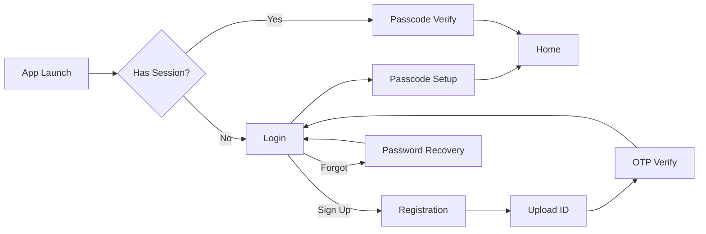

# Flows Index - O(1) Lookup

> **Purpose**: Instant lookup for all user flows.
> **Created**: 2026-01-19
> **Project**: mifos-mobile

---

## Quick Reference

| Flow | File | Screens | Status | Related Features |
|------|------|:-------:|:------:|------------------|
| authentication | `flows/authentication.mmd` | 12 | ✅ | auth, passcode |

---

## Flow Diagrams

### Authentication Flow

---

## Flow Coverage

| Feature | Has Flow | Flow Name |
|---------|:--------:|-----------|
| auth | ✅ | authentication |
| passcode | ✅ | authentication (sub-flow) |
| home | ❌ | - |
| accounts | ❌ | - |
| savings-account | ❌ | - |
| loan-account | ❌ | - |
| beneficiary | ❌ | - |
| transfer | ❌ | - |

---

## Commands

| Command | Purpose |
|---------|---------|
| /flow [name] | Visualize flow |
| /flow-full | Full app flow |
| /flow-validate | Verify coverage |
| /flow-generate | Create new flow |
| /flow-create | Interactive wizard |
