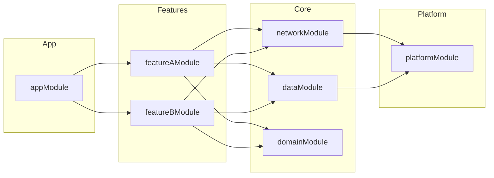

# template_meta
# template_version: "2.84.0"
# template_path: "templates/blueprints/workspace-project/infrastructure-layer/DI_WIRING.md"
# last_modified: "2026-03-20"

# Dependency Injection Wiring

> **Purpose**: Document Koin module structure, scopes, and injection points.
> **Project Type**: KMP (kmp-app, kmp-library)

---

## Module Graph



---

## Koin Modules

| Module | Scope | Description | Dependencies |
|--------|-------|-------------|--------------|
| appModule | Application | App-level singletons | All feature modules |
| networkModule | Application | HTTP client, API services | platformModule |
| dataModule | Application | Repositories, local DB | networkModule |
| domainModule | Application | Use cases, mappers | dataModule |
| featureAModule | Feature | Feature A ViewModels | domainModule |
| featureBModule | Feature | Feature B ViewModels | domainModule |
| platformModule | Application | Platform expect/actual | - |

---

## Module Definitions

### appModule

```kotlin
val appModule = module {
    includes(
        networkModule,
        dataModule,
        domainModule,
        featureAModule,
        featureBModule,
        platformModule
    )

    // App-level dependencies
    single<AppConfig> { AppConfigImpl() }
    single<AnalyticsTracker> { AnalyticsTrackerImpl(get()) }
}
```

### networkModule

```kotlin
val networkModule = module {
    single<HttpClient> {
        HttpClient(get<HttpClientEngine>()) {
            install(ContentNegotiation) {
                json(get<Json>())
            }
            install(Logging) {
                level = LogLevel.BODY
            }
        }
    }

    single<Json> {
        Json {
            ignoreUnknownKeys = true
            prettyPrint = true
        }
    }

    single<ApiService> { ApiServiceImpl(get()) }
}
```

### dataModule

```kotlin
val dataModule = module {
    single<AppDatabase> { createDatabase(get()) }

    single<UserRepository> { UserRepositoryImpl(get(), get()) }
    single<FeatureRepository> { FeatureRepositoryImpl(get(), get()) }

    single<LocalDataSource> { LocalDataSourceImpl(get()) }
    single<RemoteDataSource> { RemoteDataSourceImpl(get()) }
}
```

### domainModule

```kotlin
val domainModule = module {
    factory<GetUserUseCase> { GetUserUseCaseImpl(get()) }
    factory<GetFeatureListUseCase> { GetFeatureListUseCaseImpl(get()) }
    factory<UpdateFeatureUseCase> { UpdateFeatureUseCaseImpl(get()) }
}
```

### featureModule (per feature)

```kotlin
val featureAModule = module {
    viewModel { FeatureAViewModel(get(), get()) }
    viewModel { (id: String) -> FeatureADetailViewModel(id, get()) }
}
```

### platformModule

```kotlin
// commonMain
expect val platformModule: Module

// androidMain
actual val platformModule = module {
    single<HttpClientEngine> { Android.create() }
    single<DatabaseDriver> { AndroidSqliteDriver(AppDatabase.Schema, get(), "app.db") }
    single<AppContext> { get<Context>() }
}

// iosMain
actual val platformModule = module {
    single<HttpClientEngine> { Darwin.create() }
    single<DatabaseDriver> { NativeSqliteDriver(AppDatabase.Schema, "app.db") }
}

// desktopMain
actual val platformModule = module {
    single<HttpClientEngine> { Java.create() }
    single<DatabaseDriver> { JdbcSqliteDriver("jdbc:sqlite:app.db") }
}
```

---

## Injection Points

| Class | Injections | Module | Scope |
|-------|------------|--------|-------|
| FeatureAViewModel | GetFeatureListUseCase, AnalyticsTracker | featureAModule | viewModel |
| UserRepository | ApiService, AppDatabase | dataModule | single |
| ApiServiceImpl | HttpClient | networkModule | single |
| HomeScreen | FeatureAViewModel | - | Compose |

---

## Scopes

| Scope | Lifecycle | Use Case |
|-------|-----------|----------|
| `single` | Application | Singletons (HttpClient, Database) |
| `factory` | Per request | Use cases, mappers |
| `viewModel` | ViewModel lifecycle | Screen ViewModels |
| `scope(qualifier)` | Custom scope | Feature scopes |

---

## Initialization

### Android

```kotlin
class MyApplication : Application() {
    override fun onCreate() {
        super.onCreate()

        startKoin {
            androidContext(this@MyApplication)
            modules(appModule)
        }
    }
}
```

### iOS

```kotlin
fun initKoin() {
    startKoin {
        modules(appModule)
    }
}
```

### Desktop

```kotlin
fun main() = application {
    startKoin {
        modules(appModule)
    }

    Window(onCloseRequest = ::exitApplication) {
        App()
    }
}
```

---

## Testing Configuration

```kotlin
val testModule = module {
    // Override real implementations with fakes
    single<UserRepository> { FakeUserRepository() }
    single<ApiService> { FakeApiService() }
    single<HttpClient> { MockHttpClient() }
}

@Before
fun setup() {
    startKoin {
        modules(appModule, testModule)
    }
}

@After
fun tearDown() {
    stopKoin()
}
```

---

## Best Practices

| Practice | Description |
|----------|-------------|
| Interface-first | Always inject interfaces, not implementations |
| Constructor injection | Prefer constructor over property injection |
| No circular deps | Use `lazy` injection if needed |
| Test modules | Create override modules for testing |
| Qualifier | Use named qualifiers for same-type bindings |

---

## Common Issues

| Issue | Solution |
|-------|----------|
| NoBeanDefFoundException | Check module is included in appModule |
| Circular dependency | Use `lazy { get<T>() }` pattern |
| Scope mismatch | Ensure parent scope includes child |
| Platform expect/actual | Verify all platforms implement actual |

---

**Template Version:** 1.0.0
**Last Updated:** 2026-03-08
