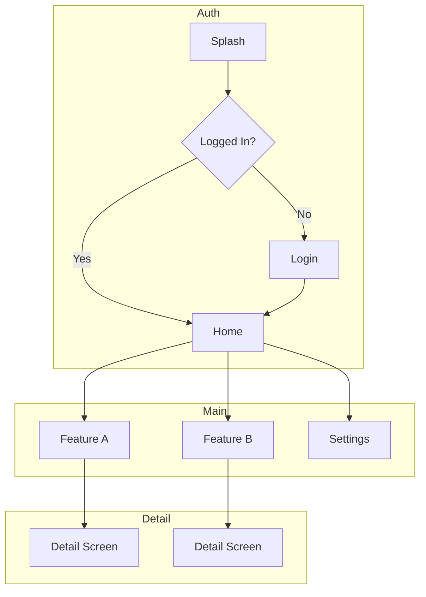

# template_meta
# template_version: "2.84.0"
# template_path: "templates/blueprints/workspace-project/infrastructure-layer/NAVIGATION.md"
# last_modified: "2026-03-20"

# Navigation Architecture

> **Purpose**: Document navigation graph, routes, deep links, and screen transitions.
> **Project Type**: KMP (kmp-app)

---

## Navigation Graph



---

## Route Definitions

| Route | Screen | Parameters | Description |
|-------|--------|------------|-------------|
| `/` | SplashScreen | - | App entry point |
| `/login` | LoginScreen | - | Authentication |
| `/home` | HomeScreen | - | Main dashboard |
| `/feature-a` | FeatureAScreen | - | Feature A list |
| `/feature-a/{id}` | FeatureADetailScreen | id: String | Feature A detail |
| `/feature-b` | FeatureBScreen | - | Feature B list |
| `/settings` | SettingsScreen | - | App settings |

---

## Deep Links

| Route | Deep Link URI | Parameters | Example |
|-------|---------------|------------|---------|
| `/feature-a/{id}` | `app://feature-a/{id}` | id: String | `app://feature-a/123` |
| `/feature-b` | `app://feature-b` | - | `app://feature-b` |
| `/settings` | `app://settings` | - | `app://settings` |

### Deep Link Configuration

**Android (AndroidManifest.xml):**
```xml
<intent-filter android:autoVerify="true">
    <action android:name="android.intent.action.VIEW" />
    <category android:name="android.intent.category.DEFAULT" />
    <category android:name="android.intent.category.BROWSABLE" />
    <data android:scheme="app" android:host="*" />
</intent-filter>
```

**iOS (Info.plist):**
```xml
<key>CFBundleURLTypes</key>
<array>
    <dict>
        <key>CFBundleURLSchemes</key>
        <array>
            <string>app</string>
        </array>
    </dict>
</array>
```

---

## Screen Transitions

| From | To | Animation | Duration |
|------|-----|-----------|----------|
| Splash | Login | Fade | 300ms |
| Splash | Home | Fade | 300ms |
| Login | Home | SlideInRight | 400ms |
| Home | Detail | SlideInRight | 300ms |
| Detail | Home | SlideOutRight | 300ms |
| Any | Settings | SlideInUp (Modal) | 350ms |

---

## Navigation Implementation

### Compose Multiplatform (Voyager/Decompose)

```kotlin
// Navigation routes
sealed class Screen {
    object Splash : Screen()
    object Login : Screen()
    object Home : Screen()
    data class FeatureDetail(val id: String) : Screen()
    object Settings : Screen()
}

// Navigator interface
interface AppNavigator {
    fun navigateTo(screen: Screen)
    fun goBack()
    fun replaceWith(screen: Screen)
    fun popToRoot()
}
```

### NavController Pattern

```kotlin
@Composable
fun AppNavHost(
    navController: NavHostController,
    startDestination: String = "splash"
) {
    NavHost(navController, startDestination) {
        composable("splash") { SplashScreen() }
        composable("login") { LoginScreen() }
        composable("home") { HomeScreen() }
        composable("feature/{id}") { backStackEntry ->
            val id = backStackEntry.arguments?.getString("id")
            FeatureDetailScreen(id)
        }
    }
}
```

---

## Back Stack Management

| Scenario | Behavior |
|----------|----------|
| Login → Home | Clear back stack (no back to login) |
| Home → Detail | Normal push (back returns to Home) |
| Deep link to Detail | Create synthetic back stack (Home → Detail) |
| Settings modal | Pop modal only (preserve underlying stack) |

---

## Navigation Events

| Event | Source | Target | Data |
|-------|--------|--------|------|
| OnLoginSuccess | LoginViewModel | Home | userId |
| OnItemClick | ListScreen | DetailScreen | itemId |
| OnLogout | SettingsViewModel | Login | - |
| OnBack | Any | Previous | - |

---

## Testing Navigation

```kotlin
@Test
fun `navigation from login to home after success`() {
    // Given
    val navigator = TestNavigator()

    // When
    navigator.navigateTo(Screen.Login)
    navigator.replaceWith(Screen.Home)

    // Then
    assertEquals(Screen.Home, navigator.currentScreen)
    assertFalse(navigator.canGoBack()) // Login not in back stack
}
```

---

**Template Version:** 1.0.0
**Last Updated:** 2026-03-08
