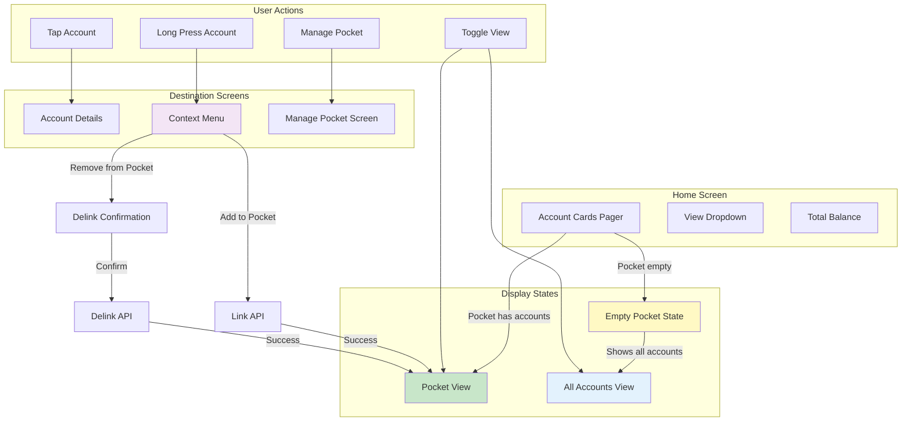

# User Flow: Pocket Management

> Favorite accounts for quick access on Home screen

---

## Flow Metadata

| Attribute | Value |
|-----------|-------|
| Flow ID | `pocket` |
| Priority | P1 |
| Screens | 4 (integrated into Home) |
| Entry Points | Home Screen (Account Pager) |
| Created | 2026-03-03 |
| Updated | 2026-03-03 |
| Status | Design |

---

## Flow Overview

Pocket acts as **"Favorites"** for accounts. Users can link their Savings, Loan, and Share accounts to Pocket for faster access on the Home screen.

### Key Behavior

| Pocket State | Home Screen Display |
|--------------|---------------------|
| **Empty (no linked accounts)** | Show ALL accounts in pager + "Add to Pocket" capability |
| **Has linked accounts** | Show ONLY Pocket accounts in pager (with toggle to see all) |

### Key Capabilities

1. **View Pocket Accounts** - See linked accounts in Home pager with aggregated balance
2. **Link Accounts** - Star/favorite accounts to add to pocket
3. **Delink Accounts** - Remove accounts from pocket (long press or manage screen)
4. **Toggle View** - Switch between Pocket view and All Accounts view

---

## User Flow Diagram

### ASCII Flow

```
┌─────────────────────────────────────────────────────────────────────────────────┐
│                    POCKET INTEGRATION WITH HOME SCREEN                           │
├─────────────────────────────────────────────────────────────────────────────────┤
│                                                                                  │
│  ┌────────────────────────────────────────────────────────────────────────────┐ │
│  │                         HOME SCREEN                                         │ │
│  ├────────────────────────────────────────────────────────────────────────────┤ │
│  │                                                                             │ │
│  │   ┌─────────────────────────────────────────────────────────────────────┐  │ │
│  │   │  [Pocket ▼] / [All Accounts ▼]           Total: ₹45,230           │  │ │
│  │   ├─────────────────────────────────────────────────────────────────────┤  │ │
│  │   │                                                                     │  │ │
│  │   │   ┌─────────┐    ┌─────────┐    ┌─────────┐                        │  │ │
│  │   │   │ Savings │    │  Loan   │    │ Shares  │   ← Horizontal Pager   │  │ │
│  │   │   │   ⭐    │    │   ⭐    │    │   ⭐    │     (swipe to browse)  │  │ │
│  │   │   │ ₹25,000 │    │ ₹-50K   │    │ ₹5,230  │                        │  │ │
│  │   │   └─────────┘    └─────────┘    └─────────┘                        │  │ │
│  │   │        ●              ○              ○                              │  │ │
│  │   └─────────────────────────────────────────────────────────────────────┘  │ │
│  │                                                                             │ │
│  │   [Request]                              [Send Money]                       │ │
│  │                                                                             │ │
│  │   Recent Transactions                                                       │ │
│  │   ─────────────────────────────────────────────────                        │ │
│  │   ...                                                                       │ │
│  │                                                                             │ │
│  └────────────────────────────────────────────────────────────────────────────┘ │
│                                                                                  │
│  INTERACTIONS:                                                                   │
│  ─────────────────────────────────────────────────────────────────              │
│                                                                                  │
│  ┌──────────────┐     ┌──────────────┐     ┌──────────────┐                     │
│  │  Tap Account │────►│   Account    │     │  Long Press  │                     │
│  │     Card     │     │   Details    │     │   Account    │                     │
│  └──────────────┘     └──────────────┘     └──────┬───────┘                     │
│                                                    │                             │
│                                                    ▼                             │
│                                             ┌──────────────┐                     │
│                                             │ Context Menu │                     │
│                                             │ • Add to ⭐   │ (if not in pocket) │
│                                             │ • Remove ⭐   │ (if in pocket)     │
│                                             │ • Set Default │                    │
│                                             └──────────────┘                     │
│                                                                                  │
│  ┌──────────────┐     ┌──────────────────────────────────────────────┐          │
│  │ Tap Dropdown │────►│  View Switcher                               │          │
│  │  [Pocket ▼]  │     │  ○ Pocket (3 accounts)                       │          │
│  └──────────────┘     │  ○ All Accounts (5 accounts)                 │          │
│                       │  ─────────────────────────                   │          │
│                       │  [Manage Pocket]                             │          │
│                       └──────────────────────────────────────────────┘          │
│                                                                                  │
└─────────────────────────────────────────────────────────────────────────────────┘
```

### Mermaid Flow



---

## Screen Specifications

### S1: Home Screen - Account Pager (Enhanced)

**Purpose:** Display accounts with Pocket integration

**States:**

#### State A: Empty Pocket (First-time User)

```
┌─────────────────────────────────────────┐
│  All Accounts                    [▼]    │  ← Dropdown (Pocket empty, shows all)
├─────────────────────────────────────────┤
│                                         │
│   ┌─────────┐  ┌─────────┐  ┌─────────┐ │
│   │ Savings │  │ Savings │  │  Loan   │ │  ← All accounts shown
│   │  #1     │  │  #2     │  │         │ │
│   │ ₹25,000 │  │ ₹10,500 │  │ ₹-50K   │ │
│   └─────────┘  └─────────┘  └─────────┘ │
│       ●            ○            ○       │
├─────────────────────────────────────────┤
│                                         │
│   💡 Tip: Long press an account to add  │
│      it to your Pocket for quick access │
│                                         │
├─────────────────────────────────────────┤
│  [Request]        [Send Money]          │
└─────────────────────────────────────────┘
```

#### State B: Pocket Has Accounts (Default View)

```
┌─────────────────────────────────────────┐
│  Pocket (3)                      [▼]    │  ← Shows pocket by default
├─────────────────────────────────────────┤
│         Total Pocket Balance            │
│            ₹ 45,230.50                  │  ← Aggregated from pocket accounts
├─────────────────────────────────────────┤
│   ┌─────────┐  ┌─────────┐  ┌─────────┐ │
│   │ Savings │  │  Loan   │  │ Shares  │ │  ← Only pocket accounts
│   │   ⭐    │  │   ⭐    │  │   ⭐    │ │  ← Star indicates "in pocket"
│   │ ₹25,000 │  │ ₹-50K   │  │ ₹5,230  │ │
│   └─────────┘  └─────────┘  └─────────┘ │
│       ●            ○            ○       │
├─────────────────────────────────────────┤
│  [Request]        [Send Money]          │
└─────────────────────────────────────────┘
```

#### State C: All Accounts View (Toggled)

```
┌─────────────────────────────────────────┐
│  All Accounts (5)                [▼]    │  ← Toggled to all
├─────────────────────────────────────────┤
│         Total Balance                   │
│            ₹ 55,730.50                  │  ← All accounts total
├─────────────────────────────────────────┤
│   ┌─────────┐  ┌─────────┐  ┌─────────┐ │
│   │ Savings │  │ Savings │  │  Loan   │ │
│   │   ⭐    │  │         │  │   ⭐    │ │  ← Star = in pocket
│   │ ₹25,000 │  │ ₹10,500 │  │ ₹-50K   │ │     No star = not in pocket
│   └─────────┘  └─────────┘  └─────────┘ │
│       ●            ○            ○   ○   │  ← More accounts
├─────────────────────────────────────────┤
│  [Request]        [Send Money]          │
└─────────────────────────────────────────┘
```

---

### S2: View Dropdown Menu

**Purpose:** Switch between Pocket and All Accounts views

**Type:** Dropdown/BottomSheet Menu

**Layout:**
```
┌─────────────────────────────────────────┐
│  Select View                            │
├─────────────────────────────────────────┤
│                                         │
│  ● Pocket (3 accounts)                  │  ← Selected
│    Your favorite accounts               │
│                                         │
│  ○ All Accounts (5 accounts)            │
│    All savings, loans & shares          │
│                                         │
├─────────────────────────────────────────┤
│  ┌─────────────────────────────────────┐│
│  │      ⚙️ Manage Pocket               ││  ← Opens Manage screen
│  └─────────────────────────────────────┘│
└─────────────────────────────────────────┘
```

**Actions:**
| Action | Result |
|--------|--------|
| Select Pocket | Filter pager to pocket accounts only |
| Select All Accounts | Show all accounts in pager |
| Manage Pocket | Navigate to S3: Manage Pocket |

---

### S3: Account Card Context Menu

**Purpose:** Quick link/delink from pocket

**Type:** Bottom Sheet (on long press)

**Layout - Account NOT in Pocket:**
```
┌─────────────────────────────────────────┐
│  Savings Account #2                     │
│  ****3456 • ₹ 10,500.00                │
├─────────────────────────────────────────┤
│                                         │
│  ⭐ Add to Pocket                       │  ← Link action
│     Quick access on home screen         │
│                                         │
│  🔄 Set as Default Account              │
│     Use for payments & transfers        │
│                                         │
│  📋 View Account Details                │
│     Transactions, statements & more     │
│                                         │
├─────────────────────────────────────────┤
│              Cancel                     │
└─────────────────────────────────────────┘
```

**Layout - Account IN Pocket:**
```
┌─────────────────────────────────────────┐
│  Savings Account                        │
│  ****1234 • ₹ 25,000.00      ⭐        │
├─────────────────────────────────────────┤
│                                         │
│  ☆ Remove from Pocket                   │  ← Delink action
│     Still accessible in All Accounts    │
│                                         │
│  🔄 Set as Default Account              │
│                                         │
│  📋 View Account Details                │
│                                         │
├─────────────────────────────────────────┤
│              Cancel                     │
└─────────────────────────────────────────┘
```

---

### S4: Manage Pocket Screen

**Purpose:** Full management of pocket accounts

**Entry:** View Dropdown > Manage Pocket

**Layout:**
```
┌─────────────────────────────────────────┐
│  ←  Manage Pocket                       │
├─────────────────────────────────────────┤
│                                         │
│  In Pocket (3)                          │
│  ─────────────────────────────────────  │
│  ┌─────────────────────────────────────┐│
│  │ 💰 Savings Account              ⭐  ││
│  │    ****1234 • ₹ 25,000.00          ││
│  ├─────────────────────────────────────┤│
│  │ 🏦 Personal Loan                ⭐  ││
│  │    ****7890 • ₹ -50,000.00         ││
│  ├─────────────────────────────────────┤│
│  │ 📈 Share Account                ⭐  ││
│  │    ****9012 • ₹ 5,230.50           ││
│  └─────────────────────────────────────┘│
│                                         │
│  Not in Pocket (2)                      │
│  ─────────────────────────────────────  │
│  ┌─────────────────────────────────────┐│
│  │ 💰 Savings Account #2           ☆  ││
│  │    ****3456 • ₹ 10,500.00          ││
│  ├─────────────────────────────────────┤│
│  │ 💳 Fixed Deposit                ☆  ││
│  │    ****5678 • ₹ 15,000.00          ││
│  └─────────────────────────────────────┘│
│                                         │
└─────────────────────────────────────────┘
```

**Interactions:**
- Tap ⭐ (filled) → Delink confirmation
- Tap ☆ (empty) → Link to pocket (immediate)
- Swipe left on pocket account → Remove option

---

### S5: Delink Confirmation

**Purpose:** Confirm removing account from pocket

**Type:** Bottom Sheet Dialog

**Layout:**
```
┌─────────────────────────────────────────┐
│                                         │
│  Remove from Pocket?                    │
│                                         │
│  💰 Savings Account                     │
│     ****1234 • ₹ 25,000.00             │
│                                         │
│  This account will still be accessible  │
│  from "All Accounts" view.              │
│                                         │
│  ┌─────────────────────────────────────┐│
│  │            Remove                   ││
│  └─────────────────────────────────────┘│
│  ┌─────────────────────────────────────┐│
│  │            Cancel                   ││
│  └─────────────────────────────────────┘│
│                                         │
└─────────────────────────────────────────┘
```

---

## State Management

### HomeState (Updated)

```kotlin
data class HomeState(
    // Existing fields
    val client: Client,
    val accounts: List<Account> = emptyList(),
    val selectedAccount: Account? = null,
    val transactions: List<Transaction>? = null,

    // NEW: Pocket integration
    val pocketAccounts: List<PocketAccount> = emptyList(),
    val isPocketEmpty: Boolean = true,              // No pocket accounts linked
    val showPocketView: Boolean = true,             // Default: show pocket if not empty
    val pocketTotalBalance: Double = 0.0,

    // Computed property
    val displayedAccounts: List<Account>
        get() = when {
            isPocketEmpty -> accounts              // Empty pocket = show all
            showPocketView -> pocketAccounts.toAccounts()  // Pocket view
            else -> accounts                       // All accounts view
        }

    val displayedTotalBalance: Double
        get() = if (showPocketView && !isPocketEmpty)
            pocketTotalBalance
        else
            accounts.sumOf { it.balance }
)
```

### HomeAction (Updated)

```kotlin
sealed interface HomeAction {
    // Existing actions...

    // NEW: Pocket actions
    data object TogglePocketView : HomeAction           // Switch pocket/all
    data class AddToPocket(val accountId: Long, val accountType: AccountType) : HomeAction
    data class RemoveFromPocket(val accountId: Long, val accountType: AccountType) : HomeAction
    data object ShowAccountContextMenu : HomeAction
    data object DismissAccountContextMenu : HomeAction
    data object NavigateToManagePocket : HomeAction
}
```

---

## API Integration

### Endpoints Required

| Endpoint | Method | Purpose |
|----------|--------|---------|
| `GET /self/pockets` | GET | Retrieve linked accounts |
| `POST /self/pockets?command=linkAccounts` | POST | Link accounts to pocket |
| `POST /self/pockets?command=delinkAccounts` | POST | Remove accounts from pocket |

### Display Logic

```kotlin
// In HomeViewModel
fun determineDisplayMode() {
    val pocketAccounts = pocketRepository.getPocket()

    if (pocketAccounts.isEmpty()) {
        // First-time user OR all accounts delinked
        updateState {
            it.copy(
                isPocketEmpty = true,
                showPocketView = false,  // Force all accounts view
                displayedAccounts = allAccounts
            )
        }
    } else {
        // Has pocket accounts - show pocket by default
        updateState {
            it.copy(
                isPocketEmpty = false,
                showPocketView = true,  // Default to pocket view
                pocketAccounts = pocketAccounts,
                displayedAccounts = pocketAccounts
            )
        }
    }
}
```

---

## Implementation Changes to Home Module

### Files to Modify

| File | Changes |
|------|---------|
| `HomeScreen.kt` | Add view dropdown, star indicators, context menu |
| `HomeViewModel.kt` | Add pocket state, fetch pocket on init, toggle logic |
| `HomeState.kt` | Add `pocketAccounts`, `isPocketEmpty`, `showPocketView` |
| `AccountCard.kt` | Add star indicator, long press handler |
| `HomeNavigation.kt` | Add `navigateToManagePocket` callback |
| `HomeModule.kt` | Inject `PocketRepository` |

### New Files to Create

| File | Purpose |
|------|---------|
| `ViewDropdownMenu.kt` | Pocket/All accounts switcher UI |
| `AccountContextMenu.kt` | Long press actions bottom sheet |
| `ManagePocketScreen.kt` | Full pocket management |
| `ManagePocketViewModel.kt` | Manage pocket state |

---

## Error Handling

| Error | User Message | Recovery |
|-------|--------------|----------|
| Pocket API 404 | No pocket exists - shows all accounts | Graceful fallback |
| Network error | "Unable to update pocket" | Retry option |
| Already linked | "Account already in pocket" | Dismiss (no-op) |

---

## Analytics Events

| Event | Parameters | Trigger |
|-------|------------|---------|
| `pocket_view_selected` | `account_count` | User switches to pocket view |
| `all_accounts_view_selected` | `account_count` | User switches to all accounts |
| `account_added_to_pocket` | `account_type`, `account_id` | Account linked via context menu |
| `account_removed_from_pocket` | `account_type`, `account_id` | Account delinked |
| `manage_pocket_opened` | - | User opens manage pocket screen |

---

## Accessibility

- View dropdown announces current selection and count
- Star icon has content description: "In Pocket" / "Not in Pocket"
- Long press triggers haptic feedback before showing menu
- Context menu options are properly labeled
- Minimum touch targets: 48dp

---

## Related

- **Feature Spec:** `features/pocket/SPEC.md`
- **API Spec:** `features/pocket/API.md`
- **Jira Tickets:** MR-16 (Roadmap), MW-378 (Epic), MW-379-387 (Stories)
