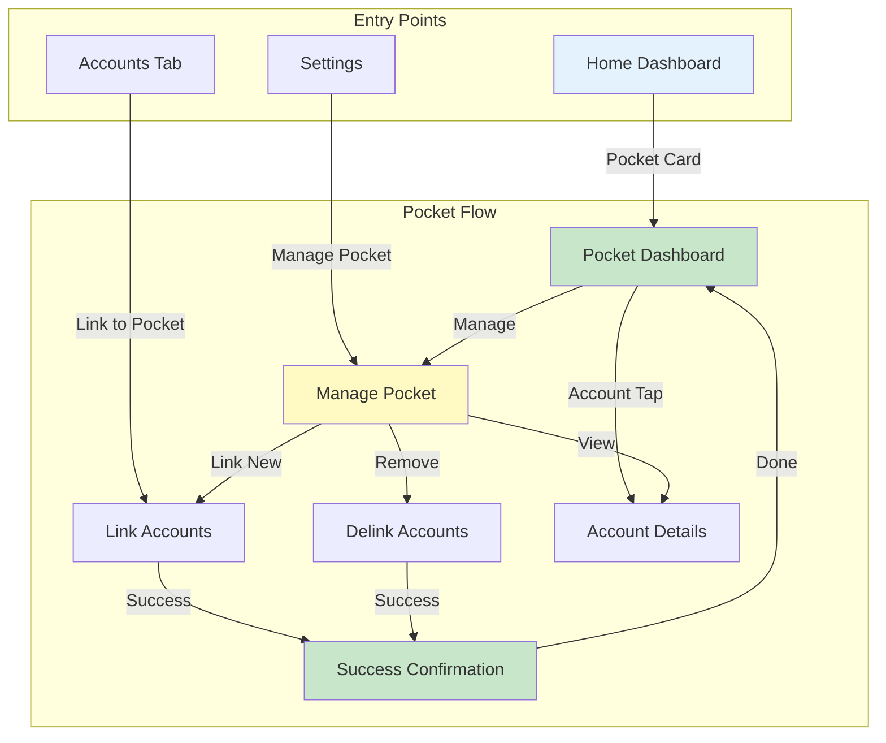

# User Flow: Pocket Management

> Manage linked accounts in a unified pocket view

---

## Flow Metadata

| Attribute | Value |
|-----------|-------|
| Flow ID | `pocket` |
| Priority | P1 |
| Screens | 5 |
| Entry Points | Home Dashboard, Accounts Tab, Settings |
| Created | 2026-03-03 |
| Status | Design |

---

## Flow Overview

The Pocket feature allows users to organize their financial accounts (savings, loans, shares) into logical groups called "pockets" for consolidated view and management.

### Key Capabilities

1. **View Pocket** - See all linked accounts with aggregated balance
2. **Link Accounts** - Add savings/loan/share accounts to pocket
3. **Delink Accounts** - Remove accounts from pocket
4. **Pocket Dashboard** - Quick access to linked accounts

---

## User Flow Diagram

### ASCII Flow

```
┌─────────────────────────────────────────────────────────────────────────────┐
│                           POCKET MANAGEMENT FLOW                              │
├─────────────────────────────────────────────────────────────────────────────┤
│                                                                               │
│  ┌─────────────┐                                                             │
│  │    HOME     │ ──────────────────────┐                                     │
│  │  Dashboard  │                       │                                     │
│  └──────┬──────┘                       │                                     │
│         │                              │                                     │
│         │ "Pocket" card                │ "View All Accounts"                 │
│         ▼                              ▼                                     │
│  ┌──────────────┐              ┌───────────────┐                             │
│  │   POCKET     │              │   ACCOUNTS    │                             │
│  │  DASHBOARD   │◄────────────►│     LIST      │                             │
│  │              │   Switch     │               │                             │
│  └──────┬───────┘              └───────┬───────┘                             │
│         │                              │                                     │
│         │ "Manage"                     │ "Link to Pocket"                    │
│         ▼                              │                                     │
│  ┌──────────────┐                      │                                     │
│  │   MANAGE     │◄─────────────────────┘                                     │
│  │   POCKET     │                                                            │
│  │              │                                                            │
│  └──────┬───────┘                                                            │
│         │                                                                    │
│         ├──────────────────┬──────────────────┐                              │
│         │                  │                  │                              │
│         ▼                  ▼                  ▼                              │
│  ┌────────────┐     ┌────────────┐     ┌────────────┐                        │
│  │   LINK     │     │  DELINK    │     │  ACCOUNT   │                        │
│  │  ACCOUNTS  │     │  ACCOUNTS  │     │  DETAILS   │                        │
│  │            │     │            │     │            │                        │
│  └─────┬──────┘     └─────┬──────┘     └────────────┘                        │
│        │                  │                                                  │
│        │ Success          │ Success                                          │
│        ▼                  ▼                                                  │
│  ┌──────────────────────────────┐                                            │
│  │   SUCCESS CONFIRMATION       │                                            │
│  │   "Account linked/delinked"  │                                            │
│  └──────────────────────────────┘                                            │
│                                                                               │
└─────────────────────────────────────────────────────────────────────────────┘
```

### Mermaid Flow



---

## Screen Specifications

### S1: Pocket Dashboard

**Purpose:** Display linked accounts with aggregated balance

**Entry:** Home > Pocket card tap

**Layout:**
```
┌─────────────────────────────────────────┐
│  ←  Pocket                    ⚙️ Manage │
├─────────────────────────────────────────┤
│                                         │
│         Total Pocket Balance            │
│            ₹ 45,230.50                  │
│                                         │
│  ┌─────────────────────────────────────┐│
│  │ Linked Accounts (3)                 ││
│  ├─────────────────────────────────────┤│
│  │ 💰 Savings Account                  ││
│  │    ****1234 • ₹ 25,000.00          ││
│  ├─────────────────────────────────────┤│
│  │ 💳 Fixed Deposit                    ││
│  │    ****5678 • ₹ 15,000.00          ││
│  ├─────────────────────────────────────┤│
│  │ 📈 Share Account                    ││
│  │    ****9012 • ₹ 5,230.50           ││
│  └─────────────────────────────────────┘│
│                                         │
│  ┌─────────────────────────────────────┐│
│  │      + Link More Accounts           ││
│  └─────────────────────────────────────┘│
│                                         │
└─────────────────────────────────────────┘
```

**Components:**
- TopAppBar with back button and manage action
- Aggregated balance card (sum of all linked accounts)
- Linked accounts list (LazyColumn)
- Account item cards with icon, name, masked number, balance
- "Link More Accounts" CTA button

**Actions:**
| Action | Target |
|--------|--------|
| Back | Navigate back |
| Manage (gear icon) | S2: Manage Pocket |
| Account tap | S5: Account Details |
| Link More | S3: Link Accounts |

---

### S2: Manage Pocket

**Purpose:** Add/remove accounts from pocket

**Entry:** Pocket Dashboard > Manage

**Layout:**
```
┌─────────────────────────────────────────┐
│  ←  Manage Pocket                       │
├─────────────────────────────────────────┤
│                                         │
│  Linked Accounts (3)                    │
│  ─────────────────────────────────────  │
│  ┌─────────────────────────────────────┐│
│  │ 💰 Savings Account          ☒ Remove││
│  │    ****1234 • ₹ 25,000.00          ││
│  ├─────────────────────────────────────┤│
│  │ 💳 Fixed Deposit            ☒ Remove││
│  │    ****5678 • ₹ 15,000.00          ││
│  ├─────────────────────────────────────┤│
│  │ 📈 Share Account            ☒ Remove││
│  │    ****9012 • ₹ 5,230.50           ││
│  └─────────────────────────────────────┘│
│                                         │
│  Available to Link                      │
│  ─────────────────────────────────────  │
│  ┌─────────────────────────────────────┐│
│  │ 💰 Secondary Savings         + Link ││
│  │    ****3456 • ₹ 10,500.00          ││
│  ├─────────────────────────────────────┤│
│  │ 🏦 Loan Account              + Link ││
│  │    ****7890 • ₹ -50,000.00         ││
│  └─────────────────────────────────────┘│
│                                         │
└─────────────────────────────────────────┘
```

**Components:**
- TopAppBar with back button
- Two sections: "Linked Accounts" and "Available to Link"
- Each account item has remove/link action button
- Swipe-to-remove gesture support (optional)

**Actions:**
| Action | Target |
|--------|--------|
| Back | Navigate back |
| Remove | S4: Delink confirmation dialog |
| + Link | S3: Link Account flow |

---

### S3: Link Accounts

**Purpose:** Select accounts to link to pocket

**Entry:** Manage Pocket > + Link OR Pocket Dashboard > Link More

**Layout:**
```
┌─────────────────────────────────────────┐
│  ←  Link Accounts                       │
├─────────────────────────────────────────┤
│                                         │
│  ┌─────────────────────────────────────┐│
│  │ 🔍 Search accounts...               ││
│  └─────────────────────────────────────┘│
│                                         │
│  Select accounts to link               │
│  ─────────────────────────────────────  │
│                                         │
│  Savings Accounts                       │
│  ┌─────────────────────────────────────┐│
│  │ ☐ Secondary Savings                 ││
│  │    ****3456 • ₹ 10,500.00          ││
│  └─────────────────────────────────────┘│
│                                         │
│  Loan Accounts                          │
│  ┌─────────────────────────────────────┐│
│  │ ☐ Personal Loan                     ││
│  │    ****7890 • Outstanding: ₹50,000 ││
│  └─────────────────────────────────────┘│
│                                         │
│  Share Accounts                         │
│  ┌─────────────────────────────────────┐│
│  │ ☐ Investment Shares                 ││
│  │    ****2345 • 100 shares           ││
│  └─────────────────────────────────────┘│
│                                         │
│  ┌─────────────────────────────────────┐│
│  │         Link Selected (2)           ││
│  └─────────────────────────────────────┘│
│                                         │
└─────────────────────────────────────────┘
```

**Components:**
- TopAppBar with back button
- Search field for filtering accounts
- Grouped list by account type (Savings, Loans, Shares)
- Multi-select checkboxes
- Sticky bottom "Link Selected" button with count

**API Call:**
```
POST self/pockets?command=linkAccounts
Body: {
  "savingsAccounts": [123, 456],
  "loanAccounts": [789],
  "shareAccounts": []
}
```

**Actions:**
| Action | Target |
|--------|--------|
| Back | Navigate back (discard selection) |
| Checkbox | Toggle account selection |
| Link Selected | API call → Success screen |

---

### S4: Delink Confirmation

**Purpose:** Confirm account removal from pocket

**Type:** Bottom Sheet Dialog

**Layout:**
```
┌─────────────────────────────────────────┐
│                                         │
│  ⚠️ Remove from Pocket?                 │
│                                         │
│  This will remove the following account │
│  from your pocket:                      │
│                                         │
│  💰 Savings Account                     │
│     ****1234 • ₹ 25,000.00             │
│                                         │
│  The account will still be accessible   │
│  from your main accounts list.          │
│                                         │
│  ┌─────────────────────────────────────┐│
│  │            Remove                   ││
│  └─────────────────────────────────────┘│
│  ┌─────────────────────────────────────┐│
│  │            Cancel                   ││
│  └─────────────────────────────────────┘│
│                                         │
└─────────────────────────────────────────┘
```

**API Call:**
```
POST self/pockets?command=delinkAccounts
Body: {
  "savingsAccounts": [123],
  "loanAccounts": [],
  "shareAccounts": []
}
```

**Actions:**
| Action | Target |
|--------|--------|
| Remove | API call → Success → Refresh list |
| Cancel | Dismiss sheet |

---

### S5: Account Details (Existing)

**Purpose:** View full account details

**Entry:** Pocket Dashboard > Account tap

**Note:** Uses existing Account Details screen from `feature:accounts` module. No new implementation needed.

---

## API Integration

### Endpoints Required

| Endpoint | Method | Purpose |
|----------|--------|---------|
| `GET self/pockets` | GET | Retrieve linked accounts |
| `POST self/pockets?command=linkAccounts` | POST | Link accounts to pocket |
| `POST self/pockets?command=delinkAccounts` | POST | Remove accounts from pocket |

### Request/Response Models

**GET self/pockets Response:**
```kotlin
@Serializable
data class PocketAccountsResponse(
    val savingsAccounts: List<PocketAccount> = emptyList(),
    val loanAccounts: List<PocketAccount> = emptyList(),
    val shareAccounts: List<PocketAccount> = emptyList()
)

@Serializable
data class PocketAccount(
    val id: Long,
    val accountNo: String,
    val productName: String,
    val accountBalance: Double,
    val currency: Currency
)
```

**Link/Delink Request:**
```kotlin
@Serializable
data class PocketLinkRequest(
    val savingsAccounts: List<Long> = emptyList(),
    val loanAccounts: List<Long> = emptyList(),
    val shareAccounts: List<Long> = emptyList()
)
```

---

## State Management

### PocketUiState

```kotlin
sealed interface PocketUiState {
    data object Loading : PocketUiState
    data class Success(
        val linkedAccounts: List<PocketAccount>,
        val totalBalance: Double,
        val currency: Currency
    ) : PocketUiState
    data class Error(val message: String) : PocketUiState
    data object Empty : PocketUiState  // No accounts linked
}
```

### ManagePocketUiState

```kotlin
data class ManagePocketUiState(
    val linkedAccounts: List<PocketAccount> = emptyList(),
    val availableAccounts: List<Account> = emptyList(),
    val selectedToLink: Set<Long> = emptySet(),
    val isLinking: Boolean = false,
    val isDelinking: Boolean = false
)
```

---

## Error Handling

| Error | User Message | Recovery |
|-------|--------------|----------|
| Network error | "Unable to load pocket. Check your connection." | Retry button |
| Account already linked | "This account is already in your pocket." | Dismiss |
| Session expired | "Session expired. Please login again." | Navigate to login |
| Server error | "Something went wrong. Please try again." | Retry button |

---

## Analytics Events

| Event | Parameters | Trigger |
|-------|------------|---------|
| `pocket_viewed` | `account_count`, `total_balance` | Dashboard opened |
| `account_linked` | `account_type`, `account_id` | Account successfully linked |
| `account_delinked` | `account_type`, `account_id` | Account successfully delinked |
| `link_failed` | `error_code`, `account_id` | Link operation failed |

---

## Accessibility

- All account balances have content descriptions
- Proper focus order: balance → accounts list → actions
- Minimum touch targets: 48dp
- Announce state changes (link/delink success)

---

## Related

- **Feature Spec:** `features/pocket/SPEC.md`
- **API Spec:** `features/pocket/API.md`
- **Existing:** Account Details screen (reused)
