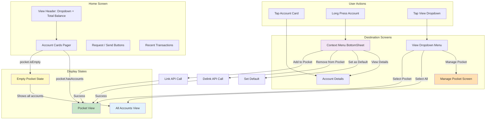

# User Flow: Pocket Management

> Favorite accounts for quick access on Home screen

---

## Flow Metadata

| Attribute | Value |
|-----------|-------|
| Flow ID | `pocket` |
| Priority | P1 |
| Screens | 4 (integrated into Home) |
| Entry Points | Home Screen (Account Pager) |
| Created | 2026-03-03 |
| Updated | 2026-03-03 |
| Status | Design Complete |
| Jira | MR-16, MW-378, MW-379-387 |

---

## Flow Overview

Pocket acts as **"Favorites"** for accounts. Users can link their Savings, Loan, and Share accounts to Pocket for faster access on the Home screen.

### Key Behavior

| Pocket State | Home Screen Display | Rationale |
|--------------|---------------------|-----------|
| **Empty (no linked accounts)** | Show ALL accounts in pager | First-time users see everything |
| **Has linked accounts** | Show ONLY Pocket accounts (default) | Quick access to favorites |
| **Toggle to All** | Show ALL accounts in pager | Full access when needed |

### Key Capabilities

1. **View Pocket Accounts** - See linked accounts in Home pager with aggregated balance
2. **Link Accounts** - Star/favorite accounts via long press context menu
3. **Delink Accounts** - Remove accounts from pocket (long press or manage screen)
4. **Toggle View** - Switch between Pocket view and All Accounts view
5. **Manage Pocket** - Dedicated screen to manage all pocket accounts

---

## User Flow Diagram

### ASCII Flow

```
┌─────────────────────────────────────────────────────────────────────────────────┐
│                    POCKET INTEGRATION WITH HOME SCREEN                           │
├─────────────────────────────────────────────────────────────────────────────────┤
│                                                                                  │
│  ┌────────────────────────────────────────────────────────────────────────────┐ │
│  │                         HOME SCREEN                                         │ │
│  ├────────────────────────────────────────────────────────────────────────────┤ │
│  │                                                                             │ │
│  │   ┌─────────────────────────────────────────────────────────────────────┐  │ │
│  │   │  [Pocket (3) ▼]                        Total: ₹45,230              │  │ │
│  │   ├─────────────────────────────────────────────────────────────────────┤  │ │
│  │   │                                                                     │  │ │
│  │   │   ┌─────────┐    ┌─────────┐    ┌─────────┐                        │  │ │
│  │   │   │ Savings │    │  Loan   │    │ Shares  │   ← Horizontal Pager   │  │ │
│  │   │   │   ⭐    │    │   ⭐    │    │   ⭐    │     (swipe to browse)  │  │ │
│  │   │   │ ₹25,000 │    │ ₹-50K   │    │ ₹5,230  │                        │  │ │
│  │   │   └─────────┘    └─────────┘    └─────────┘                        │  │ │
│  │   │        ●              ○              ○                              │  │ │
│  │   └─────────────────────────────────────────────────────────────────────┘  │ │
│  │                                                                             │ │
│  │   [Request]                              [Send Money]                       │ │
│  │                                                                             │ │
│  │   Recent Transactions                                                       │ │
│  │   ─────────────────────────────────────────────────                        │ │
│  │   ...                                                                       │ │
│  │                                                                             │ │
│  └────────────────────────────────────────────────────────────────────────────┘ │
│                                                                                  │
│  INTERACTIONS:                                                                   │
│  ─────────────────────────────────────────────────────────────────              │
│                                                                                  │
│  ┌──────────────┐     ┌──────────────┐     ┌──────────────┐                     │
│  │  Tap Account │────►│   Account    │     │  Long Press  │                     │
│  │     Card     │     │   Details    │     │   Account    │                     │
│  └──────────────┘     └──────────────┘     └──────┬───────┘                     │
│                                                    │                             │
│                                                    ▼                             │
│                                             ┌──────────────┐                     │
│                                             │ Context Menu │                     │
│                                             │ • Add to ⭐   │ (if not in pocket) │
│                                             │ • Remove ⭐   │ (if in pocket)     │
│                                             │ • Set Default │                    │
│                                             │ • View Details│                    │
│                                             └──────────────┘                     │
│                                                                                  │
│  ┌──────────────┐     ┌──────────────────────────────────────────────┐          │
│  │ Tap Dropdown │────►│  View Switcher (DropdownMenu)                │          │
│  │  [Pocket ▼]  │     │  ✓ Pocket (3 accounts)                       │          │
│  └──────────────┘     │  ○ All Accounts (5 accounts)                 │          │
│                       │  ─────────────────────────                   │          │
│                       │  ⚙️ Manage Pocket                             │          │
│                       └──────────────────────────────────────────────┘          │
│                                                                                  │
└─────────────────────────────────────────────────────────────────────────────────┘
```

### Mermaid Flow



---

## Screen Specifications

### S1: Home Screen - Account Pager (Enhanced)

**Purpose:** Display accounts with Pocket integration

**File:** `feature/home/src/commonMain/kotlin/org/mifospay/feature/home/HomeScreen.kt`

#### State A: Empty Pocket (First-time User)

```
┌─────────────────────────────────────────┐
│  All Accounts (5)                [▼]    │  ← Dropdown disabled (pocket empty)
├─────────────────────────────────────────┤
│         Total Balance                   │
│            ₹ 55,730.50                  │  ← All accounts total
├─────────────────────────────────────────┤
│   ┌─────────┐  ┌─────────┐  ┌─────────┐ │
│   │ Savings │  │ Savings │  │  Loan   │ │  ← All accounts shown
│   │  #1     │  │  #2     │  │         │ │    No stars (none in pocket)
│   │ ₹25,000 │  │ ₹10,500 │  │ ₹-50K   │ │
│   └─────────┘  └─────────┘  └─────────┘ │
│       ●            ○            ○   ○   │
├─────────────────────────────────────────┤
│                                         │
│   💡 Tip: Long press an account to add  │
│      it to your Pocket for quick access │
│                                         │
├─────────────────────────────────────────┤
│  [Request]        [Send Money]          │
└─────────────────────────────────────────┘
```

**Logic:**
```kotlin
// In HomeViewModel
if (pocket.isEmpty) {
    displayedAccounts = accounts  // Show all
    showPocketView = false        // Force all accounts view
}
```

#### State B: Pocket Has Accounts (Default View)

```
┌─────────────────────────────────────────┐
│  Pocket (3)                      [▼]    │  ← Shows pocket by default
├─────────────────────────────────────────┤
│         Total Pocket Balance            │
│            ₹ 45,230.50                  │  ← Aggregated from pocket accounts
├─────────────────────────────────────────┤
│   ┌─────────┐  ┌─────────┐  ┌─────────┐ │
│   │ Savings │  │  Loan   │  │ Shares  │ │  ← Only pocket accounts
│   │   ⭐    │  │   ⭐    │  │   ⭐    │ │  ← Star indicates "in pocket"
│   │ ₹25,000 │  │ ₹-50K   │  │ ₹5,230  │ │
│   └─────────┘  └─────────┘  └─────────┘ │
│       ●            ○            ○       │
├─────────────────────────────────────────┤
│  [Request]        [Send Money]          │
└─────────────────────────────────────────┘
```

**Logic:**
```kotlin
// In HomeViewModel
if (pocket.accounts.isNotEmpty()) {
    displayedAccounts = pocket.accounts.map { it.toAccount() }
    showPocketView = true  // Default to pocket view
}
```

#### State C: All Accounts View (Toggled)

```
┌─────────────────────────────────────────┐
│  All Accounts (5)                [▼]    │  ← Toggled to all
├─────────────────────────────────────────┤
│         Total Balance                   │
│            ₹ 55,730.50                  │  ← All accounts total
├─────────────────────────────────────────┤
│   ┌─────────┐  ┌─────────┐  ┌─────────┐ │
│   │ Savings │  │ Savings │  │  Loan   │ │
│   │   ⭐    │  │         │  │   ⭐    │ │  ← Star = in pocket
│   │ ₹25,000 │  │ ₹10,500 │  │ ₹-50K   │ │     No star = not in pocket
│   └─────────┘  └─────────┘  └─────────┘ │
│       ●            ○            ○   ○   │  ← More accounts (5 total)
├─────────────────────────────────────────┤
│  [Request]        [Send Money]          │
└─────────────────────────────────────────┘
```

---

### S2: View Dropdown Menu

**Purpose:** Switch between Pocket and All Accounts views

**File:** `feature/home/src/commonMain/kotlin/org/mifospay/feature/home/components/ViewDropdownMenu.kt`

**Type:** DropdownMenu (Material3)

**Layout:**
```
┌─────────────────────────────────────────┐
│  ✓ Pocket (3 accounts)                  │  ← Selected (checkmark)
│    Your favorite accounts               │
├─────────────────────────────────────────┤
│  ○ All Accounts (5 accounts)            │  ← Not selected
│    All savings, loans & shares          │
├─────────────────────────────────────────┤
│  ⚙️ Manage Pocket                        │  ← Opens ManagePocketScreen
└─────────────────────────────────────────┘
```

**Implementation:**
```kotlin
@Composable
fun ViewDropdownMenu(
    isExpanded: Boolean,
    showPocketView: Boolean,
    pocketCount: Int,
    allAccountsCount: Int,
    onDismiss: () -> Unit,
    onSelectPocket: () -> Unit,
    onSelectAll: () -> Unit,
    onManagePocket: () -> Unit,
)
```

**Actions:**
| Action | Result |
|--------|--------|
| Select Pocket | `showPocketView = true`, filter pager to pocket |
| Select All Accounts | `showPocketView = false`, show all accounts |
| Manage Pocket | Navigate to ManagePocketScreen |

---

### S3: Account Card Context Menu

**Purpose:** Quick link/delink from pocket via long press

**File:** `feature/home/src/commonMain/kotlin/org/mifospay/feature/home/components/AccountContextMenu.kt`

**Type:** ModalBottomSheet (Material3)

**Trigger:** Long press on AccountCard

**Layout - Account NOT in Pocket:**
```
┌─────────────────────────────────────────┐
│  Savings Account #2                     │
│  ****3456 • ₹ 10,500.00                │
├─────────────────────────────────────────┤
│                                         │
│  ⭐ Add to Pocket                       │  ← Link action
│     Quick access on home screen         │
│                                         │
│  🔄 Set as Default Account              │
│     Use for payments & transfers        │
│                                         │
│  📋 View Account Details                │
│     Transactions, statements & more     │
│                                         │
└─────────────────────────────────────────┘
```

**Layout - Account IN Pocket:**
```
┌─────────────────────────────────────────┐
│  Savings Account                   ⭐   │
│  ****1234 • ₹ 25,000.00                │
├─────────────────────────────────────────┤
│                                         │
│  ☆ Remove from Pocket                   │  ← Delink action
│     Still accessible in All Accounts    │
│                                         │
│  🔄 Set as Default Account              │
│                                         │
│  📋 View Account Details                │
│                                         │
└─────────────────────────────────────────┘
```

**Implementation:**
```kotlin
@Composable
fun AccountContextMenu(
    account: Account,
    isInPocket: Boolean,
    onDismiss: () -> Unit,
    onAddToPocket: () -> Unit,
    onRemoveFromPocket: () -> Unit,
    onSetAsDefault: () -> Unit,
    onViewDetails: () -> Unit,
)
```

---

### S4: Manage Pocket Screen

**Purpose:** Full management of pocket accounts

**File:** `feature/pocket/src/commonMain/kotlin/org/mifospay/feature/pocket/ManagePocketScreen.kt`

**Entry:** View Dropdown > Manage Pocket

**Layout:**
```
┌─────────────────────────────────────────┐
│  ←  Manage Pocket                       │
├─────────────────────────────────────────┤
│                                         │
│  In Pocket (3)                          │
│  ─────────────────────────────────────  │
│  ┌─────────────────────────────────────┐│
│  │ 💰 Savings Account              ⭐  ││  ← Tap star to remove
│  │    ****1234 • ₹ 25,000.00          ││
│  ├─────────────────────────────────────┤│
│  │ 🏦 Personal Loan                ⭐  ││
│  │    ****7890 • ₹ -50,000.00         ││
│  ├─────────────────────────────────────┤│
│  │ 📈 Share Account                ⭐  ││
│  │    ****9012 • ₹ 5,230.50           ││
│  └─────────────────────────────────────┘│
│                                         │
│  Not in Pocket (2)                      │
│  ─────────────────────────────────────  │
│  ┌─────────────────────────────────────┐│
│  │ 💰 Savings Account #2           ☆  ││  ← Tap star to add
│  │    ****3456 • ₹ 10,500.00          ││
│  ├─────────────────────────────────────┤│
│  │ 💳 Fixed Deposit                ☆  ││
│  │    ****5678 • ₹ 15,000.00          ││
│  └─────────────────────────────────────┘│
│                                         │
└─────────────────────────────────────────┘
```

**Interactions:**
- Tap ⭐ (filled gold) → Show delink confirmation → Remove from pocket
- Tap ☆ (outline) → Add to pocket immediately
- Swipe left on pocket account → Remove option (optional gesture)

---

## State Management

### HomeState (Extended for Pocket)

**File:** `feature/home/src/commonMain/kotlin/org/mifospay/feature/home/HomeViewModel.kt`

```kotlin
@Serializable
data class HomeState(
    // Existing fields
    val client: Client,
    val defaultAccountId: Long?,
    val accounts: List<Account> = emptyList(),
    val selectedAccount: Account? = null,
    val transactions: List<Transaction>? = null,
    val isRefreshing: Boolean = false,
    val viewState: ViewState = ViewState.Loading,

    // NEW: Pocket integration
    val pocket: Pocket = Pocket.EMPTY,
    val showPocketView: Boolean = true,
    val showViewDropdown: Boolean = false,
    val showContextMenu: Boolean = false,
    val contextMenuAccount: Account? = null,
) {
    // Computed: accounts to display based on view mode
    val displayedAccounts: List<Account>
        get() = when {
            pocket.isEmpty -> accounts                    // Empty = show all
            showPocketView -> pocket.accounts.toAccounts() // Pocket view
            else -> accounts                              // All accounts view
        }

    // Computed: total balance to display
    val displayedTotalBalance: Double
        get() = if (showPocketView && !pocket.isEmpty) {
            pocket.totalBalance
        } else {
            accounts.sumOf { it.balance }
        }

    // Check if account is in pocket
    fun isInPocket(accountId: Long): Boolean =
        pocket.accounts.any { it.id == accountId }
}
```

### HomeAction (Extended)

```kotlin
sealed interface HomeAction {
    // Existing actions
    data object RequestClicked : HomeAction
    data object SendClicked : HomeAction
    data class AccountDetailsClicked(val accountId: Long) : HomeAction
    data class MarkAsDefault(val accountId: Long, val accountNo: String) : HomeAction

    // NEW: Pocket actions
    data object TogglePocketView : HomeAction
    data object ShowViewDropdown : HomeAction
    data object DismissViewDropdown : HomeAction
    data class ShowContextMenu(val account: Account) : HomeAction
    data object DismissContextMenu : HomeAction
    data class AddToPocket(val accountId: Long) : HomeAction
    data class RemoveFromPocket(val accountId: Long) : HomeAction
    data object NavigateToManagePocket : HomeAction
}
```

### HomeEvent (Extended)

```kotlin
sealed interface HomeEvent {
    // Existing events
    data object NavigateBack : HomeEvent
    data class NavigateToAccountDetail(val accountId: Long) : HomeEvent

    // NEW: Pocket events
    data object NavigateToManagePocket : HomeEvent
    data class ShowToast(val message: String) : HomeEvent
}
```

---

## API Integration

### Endpoints

| Endpoint | Method | Purpose |
|----------|--------|---------|
| `GET /self/pockets` | GET | Retrieve linked accounts |
| `POST /self/pockets?command=linkAccounts` | POST | Link accounts to pocket |
| `POST /self/pockets?command=delinkAccounts` | POST | Remove accounts from pocket |

### PocketService (Ktorfit)

**File:** `core/network/src/commonMain/kotlin/org/mifospay/core/network/services/PocketService.kt`

```kotlin
interface PocketService {
    @GET(ApiEndPoints.POCKETS)
    fun getPocketAccounts(): Flow<PocketAccountsEntity>

    @POST(ApiEndPoints.POCKETS)
    suspend fun linkAccounts(
        @Query("command") command: String = "linkAccounts",
        @Body request: PocketLinkRequest,
    ): PocketCommandResponse

    @POST(ApiEndPoints.POCKETS)
    suspend fun delinkAccounts(
        @Query("command") command: String = "delinkAccounts",
        @Body request: PocketLinkRequest,
    ): PocketCommandResponse
}
```

### PocketRepository

**File:** `core/data/src/commonMain/kotlin/org/mifospay/core/data/repository/PocketRepository.kt`

```kotlin
interface PocketRepository {
    fun getPocket(): Flow<DataState<Pocket>>
    suspend fun linkAccount(accountId: Long, accountType: PocketAccountType): DataState<Unit>
    suspend fun delinkAccount(accountId: Long, accountType: PocketAccountType): DataState<Unit>
    fun isAccountInPocket(accountId: Long): Boolean
}
```

### Display Logic (HomeViewModel)

```kotlin
// Fetch pocket on init
private fun getPocket() {
    launchIO {
        pocketRepository.getPocket().collect { result ->
            when (result) {
                is DataState.Success -> {
                    mutableStateFlow.update {
                        it.copy(
                            pocket = result.data,
                            showPocketView = result.data.accounts.isNotEmpty(),
                        )
                    }
                }
                is DataState.Error -> {
                    // Silent fail - pocket is optional
                    mutableStateFlow.update {
                        it.copy(pocket = Pocket.EMPTY, showPocketView = false)
                    }
                }
                else -> {}
            }
        }
    }
}
```

---

## Implementation Phases

### Phase 1: Server Layer (~2 hours)
- [ ] Add `POCKETS = "self/pockets"` to ApiEndPoints.kt
- [ ] Create PocketService.kt (Ktorfit interface)
- [ ] Create entity models (PocketAccountsEntity, PocketLinkRequest, etc.)
- [ ] Register service in FineractApiManager

### Phase 2: Client Layer (~2 hours)
- [ ] Create domain models (Pocket, PocketAccount, PocketAccountType)
- [ ] Create PocketRepository interface
- [ ] Create PocketRepositoryImpl with caching
- [ ] Register in RepositoryModule (Koin DI)

### Phase 3: Feature Layer - Home Integration (~4 hours)
- [ ] Extend HomeState with pocket fields
- [ ] Extend HomeAction/HomeEvent
- [ ] Inject PocketRepository into HomeViewModel
- [ ] Add pocket fetch on init
- [ ] Add star indicator (⭐) to AccountCard
- [ ] Add long press handler with combinedClickable
- [ ] Create ViewDropdownMenu component
- [ ] Create AccountContextMenu component
- [ ] Update HomeScreen layout

### Phase 4: Manage Pocket Screen (~2 hours)
- [ ] Create ManagePocketScreen
- [ ] Create ManagePocketViewModel
- [ ] Add navigation from Home

### Phase 5: Testing (~2 hours)
- [ ] Unit tests for PocketRepository
- [ ] Unit tests for HomeViewModel pocket logic
- [ ] UI tests for pocket interactions

---

## Error Handling

| Error | User Message | Recovery |
|-------|--------------|----------|
| Pocket API 404 | (Silent - shows all accounts) | Graceful fallback |
| Network error | "Unable to update pocket" | Retry option / Toast |
| Already linked | "Account already in pocket" | Dismiss (no-op) |
| Last account delinked | (Switch to All Accounts view) | Automatic |

---

## Analytics Events

| Event | Parameters | Trigger |
|-------|------------|---------|
| `pocket_view_selected` | `account_count` | User switches to pocket view |
| `all_accounts_view_selected` | `account_count` | User switches to all accounts |
| `account_added_to_pocket` | `account_type`, `account_id` | Long press > Add to Pocket |
| `account_removed_from_pocket` | `account_type`, `account_id` | Long press > Remove |
| `manage_pocket_opened` | - | Dropdown > Manage Pocket |

---

## Accessibility

- View dropdown announces: "Pocket, 3 accounts" or "All Accounts, 5 accounts"
- Star icon content description: "In Pocket" / "Not in Pocket"
- Long press triggers haptic feedback before showing context menu
- Context menu options are ListItems with proper labels
- Minimum touch targets: 48dp

---

## Jira Ticket Mapping

| Ticket | Description | Phase |
|--------|-------------|-------|
| MR-16 | Roadmap: Pocket Flow | - |
| MW-378 | Epic: Pocket Management | - |
| MW-379 | [SCREEN] Pocket Dashboard (Home integration) | Phase 3 |
| MW-380 | [SCREEN] Manage Pocket | Phase 4 |
| MW-381 | [SCREEN] Link Accounts (via context menu) | Phase 3 |
| MW-382 | [SCREEN] Delink Confirmation | Phase 3 |
| MW-383 | [API] Implement Pocket Service | Phase 1 |
| MW-384 | [REPO] Implement Pocket Repository | Phase 2 |
| MW-385 | [VM] Implement Pocket ViewModels | Phase 3 |
| MW-386 | [NAV] Add Pocket Navigation | Phase 3-4 |
| MW-387 | [TEST] Pocket Feature Tests | Phase 5 |

---

## Related Documents

- **Feature Spec:** `features/pocket/SPEC.md`
- **API Spec:** `features/pocket/API.md`
- **Implementation Plan:** `features/pocket/IMPLEMENTATION_PLAN.md`
- **Status:** `features/pocket/STATUS.md`

---

## Commands

```bash
# Implement server layer
/server pocket

# Implement client layer
/client pocket

# Implement feature layer (Home integration + Manage screen)
/feature pocket

# Run tests
/test pocket
```
